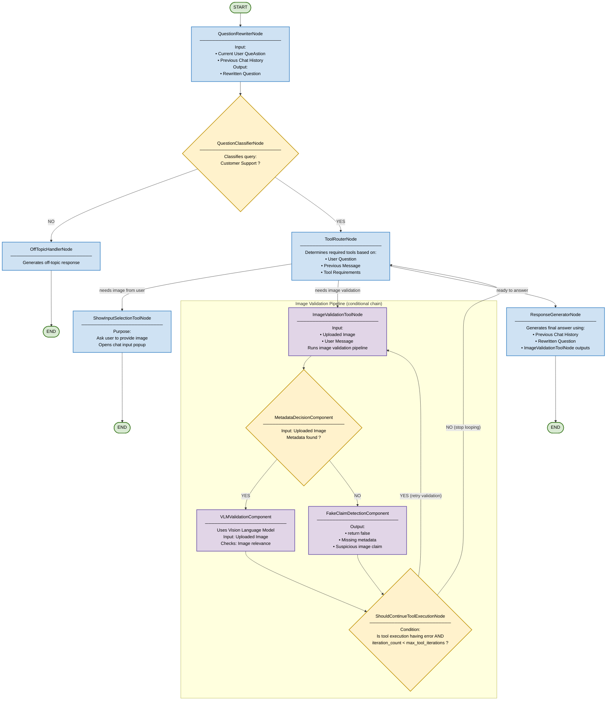

```mermaid

flowchart TD
    %% ================= ENTRY =================
    START(["START"]) --> QR

    %% ================= QUERY UNDERSTANDING =================
    QR["QuestionRewriterNode<br/>──────────────────────────<br/>Input:<br/>• Current User QueAstion<br/>• Previous Chat History<br/>Output:<br/>• Rewritten Question"]
    QR --> QC
    QC{"QuestionClassifierNode<br/>──────────────────────────<br/>Classifies query:<br/>Customer Support ?"}

    %% ================= OFF-TOPIC BRANCH =================
    QC -- "NO" --> OT
    OT["OffTopicHandlerNode<br/>──────────────────────────<br/>Generates off-topic response"]
    OT --> END_OT(["END"])

    %% ================= TOOL ROUTING =================
    QC -- "YES" --> TR
    TR["ToolRouterNode<br/>──────────────────────────<br/>Determines required tools based on:<br/>• User Question<br/>• Previous Message<br/>• Tool Requirements"]

    TR -- "needs image from user" --> SIS
    TR -- "needs image validation" --> IV
    TR -- "ready to answer" --> RG

    SIS["ShowInputSelectionToolNode<br/>──────────────────────────<br/>Purpose:<br/>Ask user to provide image<br/>Opens chat input popup"]
    SIS --> END_SIS(["END"])

    %% ================= IMAGE VALIDATION PIPELINE =================
    subgraph IMG_VALIDATION["Image Validation Pipeline (conditional chain)"]
        IV["ImageValidationToolNode<br/>──────────────────────────<br/>Input:<br/>• Uploaded Image<br/>• User Message<br/>Runs image validation pipeline"]
        IV --> MD
        MD{"MetadataDecisionComponent<br/>──────────────────────────<br/>Input: Uploaded Image<br/>Metadata found ?"}
        MD -- "YES" --> VLM
        MD -- "NO" --> FCD
        VLM["VLMValidationComponent<br/>──────────────────────────<br/>Uses Vision Language Model<br/>Input: Uploaded Image<br/>Checks: Image relevance"]
        FCD["FakeClaimDetectionComponent<br/>──────────────────────────<br/>Output:<br/>• return false<br/>• Missing metadata<br/>• Suspicious image claim"]
        VLM --> SC
        FCD --> SC
        SC{"ShouldContinueToolExecutionNode<br/>──────────────────────────<br/>Condition:<br/>Is tool execution having error AND<br/>iteration_count &lt; max_tool_iterations ?"}
    end

    %% ================= LOOP / EXIT =================
    SC -- "YES (retry validation)" --> IV
    SC -- "NO (stop looping)" --> TR
    %% If validation should flow straight to the answer instead,
    %% delete the line above and uncomment this one:
    %% SC -- "NO" --> RG

    %% ================= FINAL RESPONSE =================
    RG["ResponseGeneratorNode<br/>──────────────────────────<br/>Generates final answer using:<br/>• Previous Chat History<br/>• Rewritten Question<br/>• ImageValidationToolNode outputs"]
    RG --> END_RG(["END"])

    %% ================= STYLING =================
    classDef startEnd fill:#d9ead3,stroke:#38761d,stroke-width:2px,color:#000;
    classDef node fill:#cfe2f3,stroke:#3d85c6,stroke-width:2px,color:#000;
    classDef decision fill:#fff2cc,stroke:#bf9000,stroke-width:2px,color:#000;
    classDef component fill:#e1d5e7,stroke:#674ea7,stroke-width:2px,color:#000;

    class START,END_OT,END_SIS,END_RG startEnd;
    class QR,TR,SIS,OT,RG node;
    class QC,MD,SC decision;
    class IV,VLM,FCD component;
```
