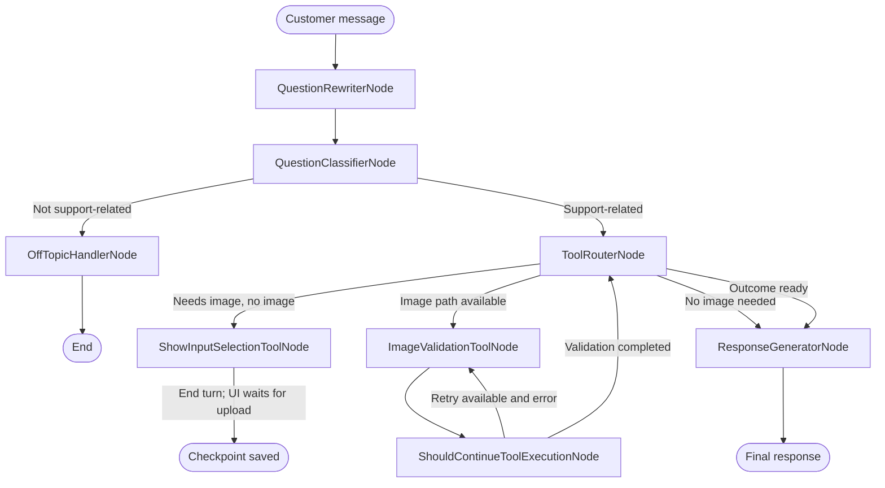
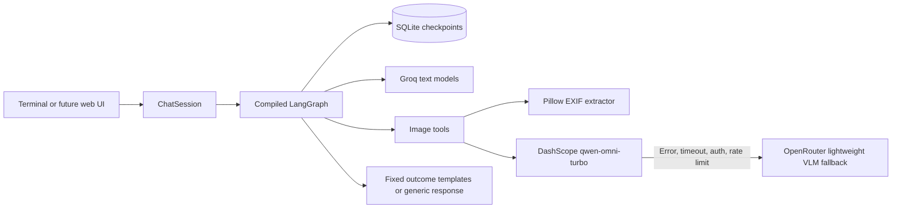
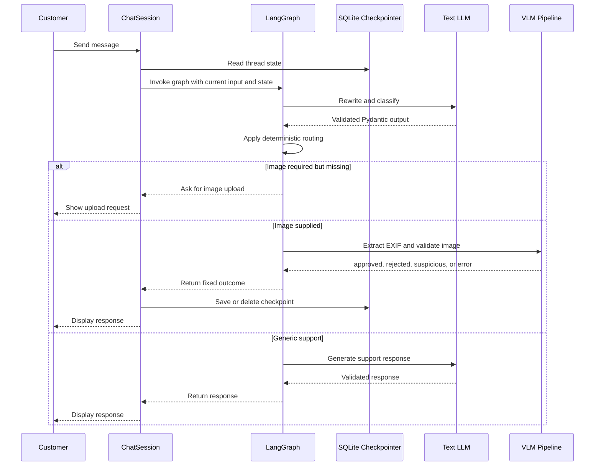
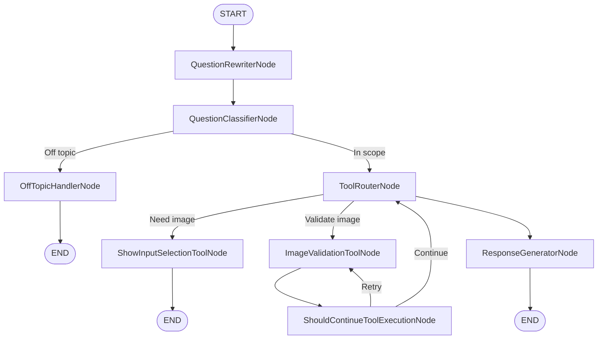
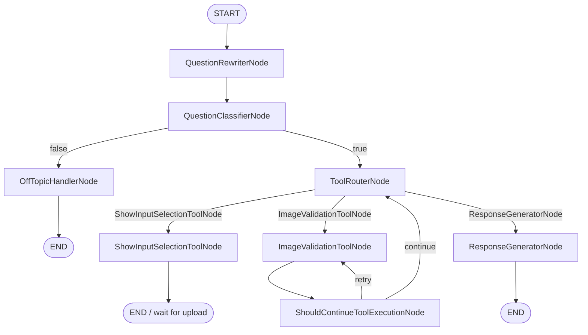
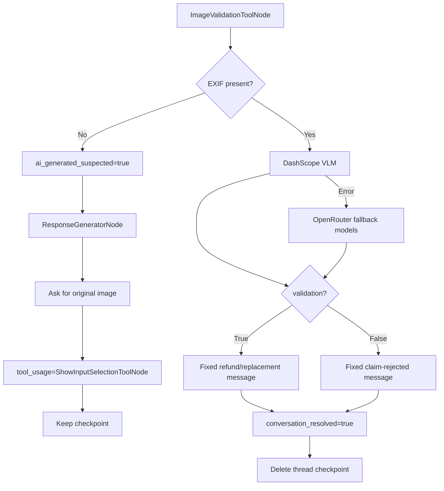
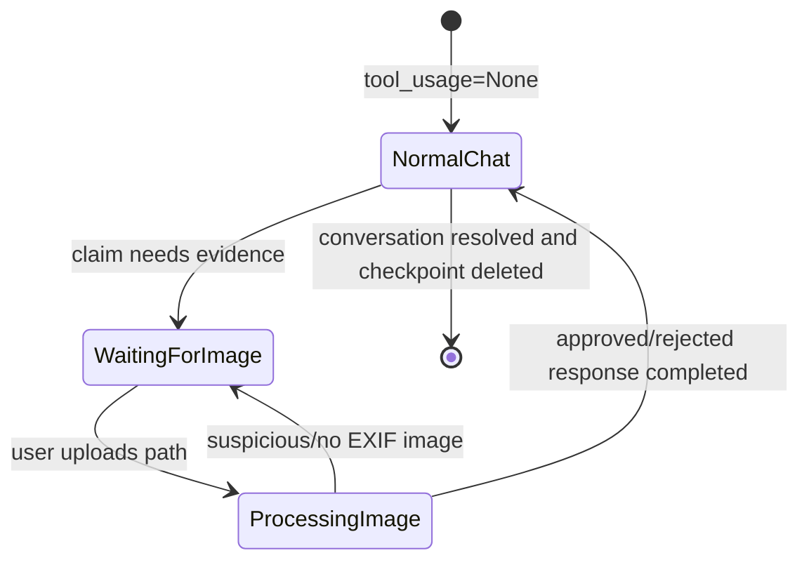

# Swiggy Support Bot

> A LangGraph-based customer-support prototype for food-delivery issues, image-evidence validation, and deterministic refund/replacement routing.

[](https://www.python.org/)
[](https://langchain-ai.github.io/langgraph/)
[](https://docs.pydantic.dev/)
[](https://github.com/)

Swiggy Support Bot is a prototype customer-support workflow built with **LangGraph**, **Groq**, **DashScope**, **OpenRouter**, **Pillow**, **Pydantic**, and a **SQLite checkpoint saver**. It supports normal text chat, damage/quality claims, local image-path input, EXIF inspection, VLM-based claim validation, retries, and explicit UI routing signals.

> **Prototype disclaimer:** This project demonstrates workflow orchestration and evidence handling. It is not a production refund system, a definitive AI-image detector, or an official Swiggy integration.

---

## Table of Contents

- [Project Overview](#project-overview)
- [Purpose](#purpose)
- [Key Features](#key-features)
- [High-Level Workflow](#high-level-workflow)
- [Architecture](#architecture)
- [LangGraph Workflow](#langgraph-workflow)
- [State Model](#state-model)
- [Routing Logic](#routing-logic)
- [Node Documentation](#node-documentation)
- [LLM and VLM Integration](#llm-and-vlm-integration)
- [Image Validation Outcomes](#image-validation-outcomes)
- [Project Structure](#project-structure)
- [Execution Flow](#execution-flow)
- [Possible Scenarios](#possible-scenarios)
- [Persistence and Checkpoints](#persistence-and-checkpoints)
- [Installation](#installation)
- [Configuration](#configuration)
- [Running the Project](#running-the-project)
- [Testing Strategy](#testing-strategy)
- [Troubleshooting](#troubleshooting)
- [Limitations](#limitations)
- [Future Improvements](#future-improvements)
- [Development Workflow](#development-workflow)
- [Contributing](#contributing)

---

## Project Overview

The bot receives a customer message and sends it through a stateful graph. The graph decides whether the request is related to food-delivery support, whether image evidence is needed, whether an image should be validated, and which customer-facing response should be returned.

The design intentionally separates:

- **LLM reasoning:** rewriting, support classification, and generic responses.
- **Deterministic routing:** deciding which graph node runs next.
- **Image tools:** EXIF extraction and VLM invocation.
- **Business outcomes:** approved evidence, rejected evidence, suspicious image, or processing failure.
- **Persistence:** storing state by conversation `thread_id` in SQLite.
- **UI control:** exposing `tool_usage` so a frontend can show an image uploader or a text box.

### Core design principles

1. Use the LLM for language understanding, not simple state-machine decisions.
2. Use Pydantic schemas to validate structured model output.
3. Use `tool_usage` as the explicit workflow/UI phase signal.
4. Keep AI-generated-image suspicion separate from claim rejection.
5. Never ask for an already-processed image again unless the user is explicitly in the re-upload flow.
6. Use fixed templates for sensitive image-evidence outcomes instead of generating them freely with an LLM.
7. Persist conversation state with SQLite rather than an in-memory checkpointer.

---

## Purpose

The prototype demonstrates how a food-delivery support assistant can handle a conversation such as:

1. A customer reports that a pizza arrived burnt.
2. The bot asks for image evidence.
3. The customer supplies a local image path.
4. The system extracts EXIF metadata.
5. If metadata is present, a VLM evaluates whether the image supports the claim.
6. A valid claim receives a short refund/replacement message.
7. A suspicious image asks for the original photo again.
8. A claim that does not match the evidence receives a separate rejection message.
9. Resolved evidence conversations are removed from the SQLite checkpoint.

The workflow is intentionally small enough to understand and extend while demonstrating patterns useful in a larger Django or API application.

---

## Key Features

### Conversational support

- Rewrites the latest message into a standalone support request.
- Classifies the request as support-related or off-topic.
- Answers ordinary questions such as cancellation, delivery, payment, and refund-policy questions.
- Maintains message history per `thread_id`.

### Image-evidence workflow

- Detects damage and quality-related claims using deterministic keywords.
- Asks for an image when evidence is required.
- Accepts a local filesystem image path in the terminal prototype.
- Extracts EXIF metadata with Pillow.
- Uses DashScope first for VLM analysis.
- Falls back to smaller OpenRouter vision models when DashScope fails.
- Separates suspicious-image outcomes from claim-rejected outcomes.

### Explicit UI state

`tool_usage` communicates the current interaction mode:

| Value | Meaning | Suggested UI |
|---|---|---|
| `None` | Normal conversation | Enable text input |
| `ShowInputSelectionToolNode` | The bot is waiting for an image | Show image uploader; disable text input |
| `ImageValidationToolNode` | Image validation is running | Show loading state; keep inputs locked |

### Persistence and cleanup

- SQLite-backed LangGraph checkpoints survive application restarts.
- Conversation state is isolated by `thread_id`.
- Approved and claim-rejected image flows are marked resolved.
- Resolved checkpoints are deleted after the final response is displayed.
- Suspicious-image flows remain active so the customer can upload a replacement image.

---

## High-Level Workflow



The graph may end after asking for an image. The next user input resumes the same SQLite thread and is interpreted as the requested image path when `tool_usage` indicates the upload state.

---

# Architecture

## Overall Architecture



## Component Interactions



## Data Flow

1. `ChatSession` reads the current SQLite checkpoint for the active `thread_id`.
2. The current user input is added without intentionally discarding important prior state.
3. The rewriter produces `rewritten_question`.
4. The classifier produces `classifier_result`.
5. The deterministic router reads `tool_usage`, image state, and claim state.
6. Image validation reads the file path, extracts EXIF, and optionally calls a VLM.
7. The result is converted into explicit state flags.
8. The response node returns either a fixed image-outcome message or a generic LLM response.
9. The UI reads `tool_usage` and `conversation_resolved`.
10. The session deletes resolved checkpoints after showing the final response.

---

# LangGraph Workflow

## Graph Nodes

| Node | Main responsibility | LLM? | Can end turn? |
|---|---|---:|---:|
| `QuestionRewriterNode` | Convert the latest message into a standalone question | Yes | No |
| `QuestionClassifierNode` | Decide whether the request is in support scope | Yes | Yes, through off-topic branch |
| `OffTopicHandlerNode` | Return a fixed scope message | No | Yes |
| `ToolRouterNode` | Select the next node from state | No | No |
| `ShowInputSelectionToolNode` | Ask for image evidence | No | Yes, waiting for next user input |
| `ImageValidationToolNode` | Extract EXIF and run VLM validation | Indirectly | No |
| `ShouldContinueToolExecutionNode` | Increment attempts and select retry/continue | No | No |
| `ResponseGeneratorNode` | Return a fixed outcome or generic support answer | Sometimes | Yes |

## Graph Construction

The graph is compiled with a SQLite checkpointer. Edges are mostly deterministic:


## Node: QuestionRewriterNode

### Purpose

Create a clear standalone form of the latest customer message so later nodes do not need to interpret incomplete references.

### Inputs

- `current_question`
- Recent `history`

### Outputs

- `rewritten_question`

### Dependencies

- Groq text model
- `RewriterOutput` Pydantic schema
- Rewriter prompt

### Next nodes

- Always `QuestionClassifierNode`

### Pseudocode

```text
read current message and recent conversation
ask the text model to rewrite the message
validate the response as RewriterOutput
store enhanced_query as rewritten_question
continue to QuestionClassifierNode
```

### Error handling

A parser or provider failure should be caught by the application-level fallback strategy. The classifier also has a deterministic keyword fallback so a transient model-format failure does not necessarily terminate the graph.

---

## Node: QuestionClassifierNode

### Purpose

Determine whether the request is related to supported food-delivery operations.

### Inputs

- `rewritten_question`

### Outputs

- `classifier_result: bool`

### Dependencies

- Groq text model
- `ClassificationOutput`

### Next nodes

- `OffTopicHandlerNode` when `classifier_result=False`
- `ToolRouterNode` when `classifier_result=True`

### Pseudocode

```text
send rewritten question to classifier model
validate boolean result
if model call or parser fails:
    use conservative keyword fallback
return support-related decision
```

### Error handling

The fallback checks terms such as order, delivery, refund, cancellation, food, item, and damage-related words. This fallback is for prototype resilience and should eventually be replaced by a tested policy classifier or explicit intent model.

---

## Node: OffTopicHandlerNode

### Purpose

Provide a safe, consistent response when the question is outside the bot's support scope.

### Inputs

- `current_question`
- `rewritten_question`

### Outputs

- `final_response`
- an appended human/AI history pair
- a tool-output log entry

### LLM usage

None. The response is fixed to avoid unnecessary model cost and drift.

### Pseudocode

```text
create fixed Swiggy Support scope message
append current customer message and assistant message to history
return final_response
end graph
```

---

## Node: ToolRouterNode

### Purpose

Select the next operation using explicit state rather than another LLM call.

### Inputs

- `tool_usage`
- `is_claim_submitted`
- `image_path`
- `rewritten_question`

### Outputs

- `router_decision`

### Why it does not use an LLM

Routing depends on exact state facts. A small model may ignore or reinterpret an explicit path or state flag. Deterministic routing is cheaper, faster, reproducible, and easier to test.

### Routing priority

```text
if tool_usage == ShowInputSelectionToolNode:
    route to ImageValidationToolNode
else if tool_usage == ImageValidationToolNode:
    route to ResponseGeneratorNode
else if is_claim_submitted:
    route to ResponseGeneratorNode
else if damage/quality claim and no image_path:
    route to ShowInputSelectionToolNode
else if image_path exists:
    route to ImageValidationToolNode
else:
    route to ResponseGeneratorNode
```

### Important implementation rule

`ImageValidationToolNode` sets `tool_usage` to `ImageValidationToolNode` after processing. `ResponseGeneratorNode` changes it to `ShowInputSelectionToolNode` only for the **next turn** in the AI-generated-image case. This prevents same-turn infinite loops.

---

## Node: ShowInputSelectionToolNode

### Purpose

Pause the conversational flow and request image evidence.

### Inputs

- Current claim context

### Outputs

- `final_response`: request for image path/upload
- `tool_usage = ShowInputSelectionToolNode`
- history update

### UI behavior

A frontend should:

- show an image upload widget,
- disable the ordinary text input,
- show a progress or instruction message,
- retain the same `thread_id` for the next upload.

### Pseudocode

```text
return "Swiggy Support: Please enter file path"
set tool_usage to ShowInputSelectionToolNode
save checkpoint
end this invocation
```

---

## Node: ImageValidationToolNode

### Purpose

Process one uploaded image and classify its evidence outcome.

### Inputs

- `image_path`
- `rewritten_question`

### Internal stages

1. Verify the path exists.
2. Open the image.
3. Extract EXIF metadata.
4. If EXIF is absent, return the suspicious-image outcome without calling a VLM.
5. If EXIF exists, call DashScope first.
6. If DashScope fails, try configured OpenRouter fallback models.
7. Parse the VLM result into `VLMOutput`.
8. Return one of `ai_generated`, `approved`, or `rejected`.

### Outputs

- `metadata`
- `vlm_result`
- `tool_usage = ImageValidationToolNode`
- `ai_generated_suspected`
- `is_claim_submitted`
- `refund_approved`
- `validation_error`
- `tool_outputs`

### Outcome logic

```text
if file is missing or unreadable:
    validation_error = True
    allow retry while attempts remain

else if EXIF is missing:
    outcome = ai_generated
    ai_generated_suspected = True
    is_claim_submitted = False
    refund_approved = False

else:
    call VLM
    if VLM validation is True:
        outcome = approved
        ai_generated_suspected = False
        is_claim_submitted = True
        refund_approved = True
    else:
        outcome = rejected
        ai_generated_suspected = False
        is_claim_submitted = True
        refund_approved = False
```

### Important limitation

Missing EXIF is not proof that an image was AI-generated. Screenshots, messaging apps, image editors, and export pipelines can remove metadata. The current behavior is intentionally strict for the prototype and should be changed to a risk signal before production use.

---

## Node: ShouldContinueToolExecutionNode

### Purpose

Control retries after hard image-processing failures.

### Inputs

- `validation_error`
- `iteration_count`
- `MAX_TOOL_ITERATIONS`

### Outputs

- incremented `iteration_count`
- conditional transition

### Pseudocode

```text
increment iteration_count
if validation_error and iteration_count < maximum:
    return ImageValidationToolNode
else:
    return ToolRouterNode
```

### Retry cases

- Missing image path
- Invalid path
- Unreadable image
- Provider failure after all VLM fallback attempts
- Invalid response that cannot be parsed

A successful VLM validation does not retry.

---

## Node: ResponseGeneratorNode

### Purpose

Produce the final customer-facing response after routing or image processing.

### Inputs

- `rewritten_question`
- `history`
- `tool_usage`
- `ai_generated_suspected`
- `is_claim_submitted`
- `refund_approved`
- `validation_error`

### Output branches

| Condition | Response | LLM? | Resolved? |
|---|---|---:|---:|
| `ai_generated_suspected=True` | Ask for original image | No | No |
| `refund_approved=True` | Refund/replacement template | No | Yes |
| `is_claim_submitted=True` and validation false | Claim-rejected template | No | Yes |
| Validation exhausted with error | Retry/manual-assistance message | No | No |
| Otherwise | Generic Swiggy Support response | Yes | No |

### Pseudocode

```text
if ai_generated_suspected:
    return original-image request
    set tool_usage = ShowInputSelectionToolNode
    keep conversation active

else if refund_approved:
    return refund/replacement template
    set conversation_resolved = True

else if is_claim_submitted:
    return claim-rejected template
    set conversation_resolved = True

else if validation_error after retries:
    return manual-assistance or retry message

else:
    call generic response LLM
    return validated ResponseOutput
```

---

# State Model

## State Field Reference

| Field | Type | Meaning | Lifecycle |
|---|---|---|---|
| `history` | list | Conversation messages | Persists within a thread |
| `current_question` | string | Latest user input | Replaced each turn |
| `rewritten_question` | string/None | Standalone interpreted request | Recomputed each turn |
| `classifier_result` | bool/None | Support scope decision | Recomputed each turn |
| `router_decision` | string/None | Selected node | Recomputed each turn |
| `image_path` | string/None | Latest image path | Present during evidence flow |
| `metadata` | dict | EXIF result | Set during image processing |
| `vlm_result` | string/None | Structured VLM evidence | Set when VLM runs |
| `fake_claim_result` | string/None | Additional evidence note | Optional diagnostic field |
| `validation_error` | bool | Last image operation failed | Set by validation node |
| `iteration_count` | int | Validation attempts | Incremented by retry node |
| `tool_outputs` | list | Internal audit/debug outputs | Accumulates in a thread |
| `final_response` | string/None | Customer-facing response | Set by terminal response node |
| `tool_usage` | string/None | UI/workflow phase | `None`, input node, or validation node |
| `ai_generated_suspected` | bool | Last upload had no EXIF | Consumed by response branch |
| `is_claim_submitted` | bool | Non-suspicious image was processed | Used for follow-up routing |
| `refund_approved` | bool | VLM supported the claim | Used for fixed approval response |
| `conversation_resolved` | bool | Thread can be deleted | Checked by session layer |

## State Invariants

The following invariants make the workflow predictable:

1. `tool_usage=ShowInputSelectionToolNode` means the next user input is expected to be an image path.
2. `tool_usage=ImageValidationToolNode` is transient and means the validation result must be rendered next.
3. `ai_generated_suspected=True` and `is_claim_submitted=True` should not normally be true together.
4. `refund_approved=True` implies `is_claim_submitted=True`.
5. `conversation_resolved=True` means the session layer may delete the thread after displaying the response.
6. A missing-EXIF image does not call the VLM in the current prototype.
7. Fixed image outcome messages do not call the generic response LLM.

---

# Routing Logic

## Routing Truth Table

| `tool_usage` | `is_claim_submitted` | `image_path` | Claim needs image | Result |
|---|---:|---|---:|---|
| `ShowInputSelectionToolNode` | any | current input treated as path | any | Image validation |
| `ImageValidationToolNode` | any | present | any | Response generation |
| `None` | true | any | any | Response generation |
| `None` | false | absent | true | Show image input |
| `None` | false | present | any | Image validation |
| `None` | false | absent | false | Generic response |

## Complete Execution Paths

### Path A: Normal support question

```text
START
-> Rewriter
-> Classifier=true
-> Router
-> ResponseGenerator
-> Generic LLM response
-> END
```

### Path B: Off-topic question

```text
START
-> Rewriter
-> Classifier=false
-> OffTopicHandler
-> END
```

### Path C: Claim without image

```text
START
-> Rewriter
-> Classifier=true
-> Router
-> ShowInputSelectionToolNode
-> END of current invocation
-> checkpoint saved with tool_usage=ShowInputSelectionToolNode
```

### Path D: Valid image and approved claim

```text
next invocation
-> Router sees ShowInputSelectionToolNode
-> ImageValidationToolNode
-> metadata found
-> DashScope VLM
-> validation=true
-> ShouldContinue
-> Router sees ImageValidationToolNode
-> ResponseGenerator
-> fixed refund message
-> conversation_resolved=true
-> display response
-> delete SQLite thread
```

### Path E: Missing EXIF / suspicious image

```text
next invocation
-> Router sees ShowInputSelectionToolNode
-> ImageValidationToolNode
-> no EXIF
-> skip VLM
-> ai_generated_suspected=true
-> ShouldContinue
-> Router sees ImageValidationToolNode
-> ResponseGenerator
-> fixed original-image request
-> tool_usage=ShowInputSelectionToolNode
-> conversation_resolved=false
-> checkpoint retained
```

### Path F: Original image but claim rejected

```text
next invocation
-> ImageValidationToolNode
-> metadata found
-> VLM validation=false
-> is_claim_submitted=true
-> ShouldContinue
-> ResponseGenerator
-> fixed claim-rejected message
-> conversation_resolved=true
-> delete SQLite thread
```

### Path G: Provider fallback

```text
ImageValidationToolNode
-> DashScope request
-> if DashScope fails:
     OpenRouter fallback model 1
     if failure: fallback model 2
     if failure: fallback model 3
-> if all fail: validation_error=true
-> retry until maximum
-> manual-assistance response
```

---

# Graph Visualization

## Node Relationship Diagram



## Image Outcome Diagram



## UI State Diagram



---

# LLM and VLM Integration

## Groq text integration

Groq is used for:

- question rewriting,
- support classification,
- generic support responses.

The configured text model is intentionally lightweight for a prototype. The router does not call Groq because deterministic routing is more reliable for explicit workflow state.

## DashScope VLM integration

DashScope is the primary VLM provider:

- model: `qwen-omni-turbo`
- OpenAI-compatible endpoint
- receives a text claim and a base64 data URL image
- returns structured content parsed into `VLMOutput`

## OpenRouter fallback

If DashScope raises an exception, the workflow tries configured OpenRouter models in order. The fallback list is intentionally composed of smaller or lower-cost vision models rather than large flagship models.

Fallback errors include:

- missing credentials,
- HTTP errors,
- timeout/network errors,
- rate limits,
- invalid model availability,
- invalid structured output.

If every provider fails, the graph sets `validation_error=True` and enters the retry flow.

## Structured output

LLM-backed nodes use Pydantic output schemas. The schema provides:

- expected field names,
- types,
- field descriptions,
- validation constraints.

The VLM output includes:

- `validation`,
- `visible_item`,
- `damage_visible`,
- `claim_consistent`,
- `confidence`,
- `reason`.

The generic response uses `ResponseOutput`.

---

# Image Validation Outcomes

## Approved

Condition:

- EXIF metadata is present.
- VLM validation is true.

Behavior:

- `is_claim_submitted=True`
- `ai_generated_suspected=False`
- `refund_approved=True`
- fixed approval message
- `conversation_resolved=True`
- checkpoint deleted after display

## AI-generated or non-original suspicion

Condition:

- EXIF metadata is absent.

Behavior:

- VLM is skipped.
- `ai_generated_suspected=True` during validation handling.
- fixed original-image message.
- `tool_usage=ShowInputSelectionToolNode` for the next turn.
- `conversation_resolved=False`.
- checkpoint remains so a replacement image can be uploaded.

The flag is consumed by the response branch and is replaced on the next image-processing turn. Missing EXIF is only a heuristic, not forensic proof.

## Claim rejected

Condition:

- EXIF metadata is present.
- VLM validation is false.

Behavior:

- `is_claim_submitted=True`
- `ai_generated_suspected=False`
- `refund_approved=False`
- fixed claim-rejected message
- `conversation_resolved=True`
- checkpoint deleted after display

This is intentionally different from the suspicious-image path: the image was processed as evidence, but it did not support the claim.

## Validation failure

Condition:

- missing path,
- unreadable file,
- provider failure,
- all VLM fallbacks fail,
- parsing failure.

Behavior:

- `validation_error=True`
- increment attempt count
- retry until `MAX_TOOL_ITERATIONS`
- show manual-assistance/retry message if attempts are exhausted
- do not falsely approve or reject the claim

---

# Project Structure

```text
project-root/
├── main.py
├── graph.py
├── schema.py
├── chains.py
├── prompts.py
├── tools.py
├── requirements.txt
├── .env                         # local secrets; do not commit
├── swiggy_support.sqlite        # generated SQLite checkpoint database
└── README.md
```

## Important files

| File | Responsibility |
|---|---|
| `main.py` | Terminal UI, command handling, session state, checkpoint cleanup, UI hints |
| `graph.py` | Graph state, nodes, deterministic routing, SQLite checkpointer |
| `schema.py` | Pydantic output schemas and initial workflow state model |
| `chains.py` | Groq chains, DashScope VLM, OpenRouter fallback logic |
| `prompts.py` | Prompt templates for LLM-backed nodes |
| `tools.py` | EXIF extraction, image loading, VLM validation adapter |
| `requirements.txt` | Python dependencies |
| `.env` | API credentials and local configuration |
| `swiggy_support.sqlite` | Persistent checkpoint database created at runtime |

---

# Execution Flow

## Start-up

1. Python starts `main.py`.
2. LangSmith tracing is disabled for the prototype if configured in the environment.
3. `build_graph()` creates the graph.
4. SQLite connection and `SqliteSaver` are initialized.
5. The terminal UI starts with a fixed `thread_id`.

## Each normal message

1. Read prior state from SQLite.
2. Build an input containing the current message and required carried-forward fields.
3. Invoke the graph.
4. Rewrite the message.
5. Classify support scope.
6. Route deterministically.
7. Generate a fixed or LLM response.
8. Display the response.
9. Delete the checkpoint only if `conversation_resolved=True`.

## Each image turn

1. Previous turn must have `tool_usage=ShowInputSelectionToolNode`.
2. The next input is treated as an image path.
3. Image validation runs.
4. EXIF is checked.
5. DashScope is called only for metadata-present images.
6. OpenRouter is used only when DashScope fails.
7. The outcome is rendered without a generic response LLM.
8. The UI state is updated for either completion or re-upload.

---

# Possible Scenarios

## Normal execution

A customer asks how to cancel an order. The request is classified as support-related, has no image requirement, and reaches the generic response node.

## Off-topic execution

A customer asks for a football score. The classifier returns false and the fixed scope message is returned.

## Missing image

A customer reports a burnt pizza without an image. The router returns `ShowInputSelectionToolNode`. The UI should disable text entry and request an upload.

## Valid approved image

The image has EXIF, DashScope validates the claim, and the fixed refund/replacement message is returned. The thread is then deleted.

## Suspicious image

The image has no EXIF. The VLM is skipped and the original-image request is returned. The thread remains so a new image can be submitted.

## Valid but rejected claim

The image has EXIF but does not visibly support the claim. The fixed claim-rejected message is returned and the thread is resolved.

## Invalid path

The file cannot be opened. The graph retries up to the configured limit. If all attempts fail, it returns a recovery message instead of crashing.

## Provider fallback

DashScope fails due to a timeout or API error. OpenRouter models are tried sequentially. If all providers fail, the retry node handles the failure.

## Process restart

Because checkpoints are stored in SQLite, a new process can recover state for the same `thread_id`, provided the same SQLite database file is available.

---

# Persistence and Checkpoints

## SQLite checkpointer

The project uses `SqliteSaver` from the `langgraph-checkpoint-sqlite` package. The checkpointer persists state snapshots associated with a `thread_id`.

### Thread identity

A thread ID identifies one logical conversation. Use a unique ID per customer session in a real application. The terminal prototype uses one fixed ID for simplicity.

### Checkpoint deletion

A resolved image-evidence conversation is deleted after its final message is displayed. This prevents old claim state from affecting a new customer request.

The `/new` command also deletes the active thread manually.

### Important operational warning

SQLite is appropriate for a prototype and lightweight synchronous use. A production system with many concurrent users should use a server database/checkpointer such as PostgreSQL and implement thread retention, access control, backups, and cleanup policies.

---

# Installation

## Requirements

Recommended environment:

- Python 3.10 or newer
- A virtual environment
- Network access to configured model providers
- `langgraph-checkpoint-sqlite` installed separately from the base LangGraph package

Install the project dependencies from `requirements.txt`. The dependency set should include:

- `langchain`
- `langchain-core`
- `langchain-groq`
- `langchain-openai`
- `langgraph`
- `langgraph-checkpoint-sqlite`
- `pydantic`
- `pillow`
- `python-dotenv`
- `openai`

---

# Configuration

Create a local `.env` file:

```text
GROQ_API_KEY=your_groq_key
DASHSCOPE_API_KEY=your_dashscope_key
OPENROUTER_API_KEY=your_openrouter_key
LANGCHAIN_TRACING_V2=false
LANGSMITH_TRACING=false
```

The first three values are required for the corresponding model paths. DashScope is attempted first for VLM requests. OpenRouter is needed for fallback operation.

## Security rules

- Never commit `.env`.
- Never print full API keys.
- Rotate keys that appear in logs or screenshots.
- Add `.env` and `*.sqlite` to `.gitignore` unless a database fixture is intentionally needed.
- Avoid storing sensitive customer images in the repository.

---

# Running the Project

Start the terminal application from the project root:

```text
python main.py
```

Available commands:

| Command | Action |
|---|---|
| `/new` | Delete the current thread and start fresh |
| `/state` | Display internal state for debugging |
| `/help` | Display command help |
| `/exit` | Exit the process |

Example interaction:

```text
You: My pizza arrived burnt
Swiggy Support: Please enter file path

You: C:\\path\\to\\pizza.jpg
Swiggy Support: We're sorry about your pizza. Refund/replacement will be processed within 24 hours...
```

For a web UI, replace the terminal input with an upload endpoint and map `tool_usage` to the frontend state.

---

# Testing Strategy

## Test categories

### Unit tests

Test independently:

- EXIF extraction with metadata.
- EXIF extraction without metadata.
- image path validation.
- keyword-based evidence detection.
- router truth-table behavior.
- fixed message selection.
- state reset behavior.

### Integration tests

Invoke the compiled graph with isolated thread IDs and verify complete paths:

1. Off-topic request.
2. Normal support request.
3. Damage claim without image.
4. Valid image with VLM approval.
5. Valid image with VLM rejection.
6. Image with no EXIF.
7. Missing image path.
8. DashScope failure followed by OpenRouter success.
9. All provider failures.
10. Follow-up message after a successful validation.
11. Checkpoint deletion after resolution.
12. Re-upload after suspicious-image outcome.

### Assertions to verify

| Assertion | Expected result |
|---|---|
| Claim without image | `tool_usage=ShowInputSelectionToolNode` |
| Next image input | `router_decision=ImageValidationToolNode` |
| VLM starts | `tool_usage=ImageValidationToolNode` |
| Approved image | `refund_approved=True` |
| Rejected image | `is_claim_submitted=True`, `refund_approved=False` |
| No EXIF | `ai_generated_suspected=True` during validation outcome |
| Suspicious response | `tool_usage=ShowInputSelectionToolNode` for next turn |
| Approved/rejected response | `conversation_resolved=True` |
| Resolved response | SQLite checkpoint deleted after display |
| Bad path | retry counter increases and no crash |

### Isolation rule

Every independent test must use a different `thread_id`, or explicitly delete the thread before reuse. Otherwise previous history and flags can contaminate the test.

---

# Troubleshooting

## `No module named langgraph.checkpoint.sqlite`

Install the separate SQLite implementation package. The base `langgraph-checkpoint` package provides interfaces but not necessarily the SQLite saver implementation.

## The bot asks for an image again after validation

Use `/state` and inspect:

- `tool_usage`
- `is_claim_submitted`
- `ai_generated_suspected`
- `image_path`
- `vlm_result`

Also verify that follow-up input preserves checkpoint state instead of creating a fresh state with defaults that overwrite saved values.

## All VLM providers fail

Check:

- API keys exist in `.env`.
- DashScope endpoint and model ID are available in your region.
- OpenRouter fallback model IDs are currently available.
- Image format and file size are supported.
- Internet access is working.

## LangSmith connection messages

Tracing is not required for this prototype. Set tracing variables to false before importing LangChain modules. If you intentionally use LangSmith, verify the API key, network access, and endpoint configuration instead.

## `IndentationError`

Use consistent four-space indentation and run a syntax check on each Python file before running the application.

## SQLite database locked

The prototype uses synchronous SQLite and is not designed for high concurrent write volume. Close duplicate processes and migrate to PostgreSQL for production concurrency.

## Missing EXIF causes a false suspicion

This is expected under the current strict prototype policy. EXIF can be removed by messaging applications, screenshots, editors, and export tools. Treat it as a risk signal rather than a final decision before production use.

---

# Limitations

- Missing EXIF is not reliable proof of AI generation.
- VLM output is probabilistic and can produce false positives or false negatives.
- The prototype does not verify an order against a real Swiggy backend.
- Refund processing is simulated by a fixed message; no payment or refund API is called.
- Local file paths are suitable for a terminal demo, not for a multi-user web deployment.
- The fixed approval message says a refund/replacement will be processed, but production logic must confirm eligibility and execute the transaction through a trusted backend.
- SQLite is not the right persistence layer for high-concurrency production traffic.
- The current keyword detector may miss informal or multilingual complaints.
- Provider pricing, model availability, rate limits, and model IDs can change.
- No authentication, authorization, audit retention, image virus scanning, or PII redaction is included.

---

# Future Improvements

## Product and business logic

- Integrate real order, payment, refund, and replacement APIs.
- Add policy-based refund eligibility before approval.
- Add order ID extraction and verification.
- Add human-review escalation for uncertain claims.
- Track claim history and abuse signals separately from image authenticity.

## Image evidence

- Use EXIF as one signal rather than a hard gate.
- Add C2PA/content-credentials checks where available.
- Add perceptual hashes and duplicate-image detection.
- Ask for a short video or second angle for ambiguous claims.
- Compare evidence with order/product metadata.
- Add an image-forensics classifier trained on representative data.

## Engineering

- Replace SQLite with PostgreSQL for concurrent production sessions.
- Add async graph execution and connection pooling.
- Add structured logging and metrics.
- Add provider timeouts, exponential backoff, and circuit breakers.
- Add automated test fixtures for all routing paths.
- Add API/Django integration and a real frontend.
- Store uploaded images in object storage with signed URLs.
- Add retention and deletion policies for image evidence and checkpoints.

## User interface

- Build upload widget behavior directly from `tool_usage`.
- Disable text input while an image is required or processing.
- Show provider-neutral progress states.
- Display customer-safe explanations while keeping diagnostic data private.

---

# Development Workflow

1. Create or activate a virtual environment.
2. Install pinned dependencies.
3. Configure `.env` locally.
4. Run syntax checks before executing the application.
5. Run unit tests for tools and routing.
6. Run integration tests with isolated `thread_id` values.
7. Manually test the terminal flow:
   - normal chat,
   - damage claim,
   - original image,
   - no-EXIF image,
   - invalid image path,
   - follow-up refund request.
8. Inspect `/state` when debugging.
9. Never commit credentials, customer images, or local SQLite data.
10. Update this README when node names, state fields, provider logic, or routing rules change.

---

# Contributing

## Pull requests should include

- A clear description of the behavior change.
- The affected node and state fields.
- Updated routing diagrams when graph edges change.
- Tests for success and failure paths.
- Documentation updates for new environment variables or provider models.
- Confirmation that no secrets or customer data were added.

## Design rules for new nodes

- Give each node one clear responsibility.
- Prefer deterministic logic for exact state transitions.
- Use Pydantic schemas for LLM output.
- Make retry behavior explicit.
- Do not expose internal fraud or metadata signals in customer-facing messages.
- Add a unique `thread_id` in integration tests.
- Document every new state field and its lifecycle.

---

# License and Disclaimer

Add the project's chosen license before publishing. This prototype is an independent educational project and is not an official Swiggy product or API integration.

---

## Quick Mental Model

```text
LLM understands language.
Python decides deterministic routing.
Pillow reads local metadata.
DashScope validates images first.
OpenRouter is the VLM fallback.
Pydantic validates structured output.
SQLite remembers the conversation.
tool_usage tells the UI what control to show.
Resolved threads are deleted after the final response.
```
